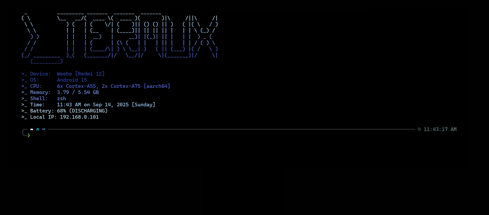

# trmxfetch

`trmxfetch` is a lightweight system information fetch script for [Termux](https://termux.dev/).
It displays system details with gradient-colored ASCII art.

---

## Requirements

This script requires the **Termux:API** package and companion Android app.

- Install the package:
  ```sh
  pkg install termux-api
  ```

* Install the companion app and grant necessary permissions:
  [Termux\:API on F-Droid](https://f-droid.org/en/packages/com.termux.api/)

* If installation fails due to low target SDK restrictions, install via ADB:

  ```sh
  adb install --bypass-low-target-sdk-block <apk_file>
  ```
* Start the Termux API package:
  ```
  termux-api-start
  ```

---

## Setup

Clone the repository: `git clone git@github.com:shashotoNur/trmxfetch.git`

The repository provides two files:

* `trmxfetch` – the main script
* `trmx.ascii` – ASCII art used for the banner

Copy both files to your home directory:

```sh
cd trmxfetch
chmod +x trmxfetch
cp trmxfetch trmx.ascii ~/.local/bin
```

---

## Usage

To run the script automatically at the start of each Termux session, add it to your shell rc file (`.bashrc`, `.zshrc`, etc.), e.g.:

```sh
echo "trmxfetch" >> ~/.zshrc
```

Open a new session to see the output.

---

## Features

* Gradient-colored ASCII art (`trmx.ascii` is user-replaceable)
* Device and OS information
* CPU model and architecture summary
* Shell information
* Current time and date
* Memory usage (used / total)
* Battery percentage and charging status (via Termux\:API)
* Local IP address (via Termux\:API)

---

## Screenshot

Example output with ASCII banner and system information:



* **Note:** This script was written and used only on the above device.

---

## License

This project is open-source and available under the [MIT License](LICENSE).

---
